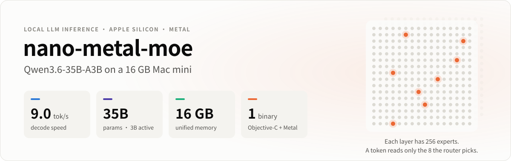
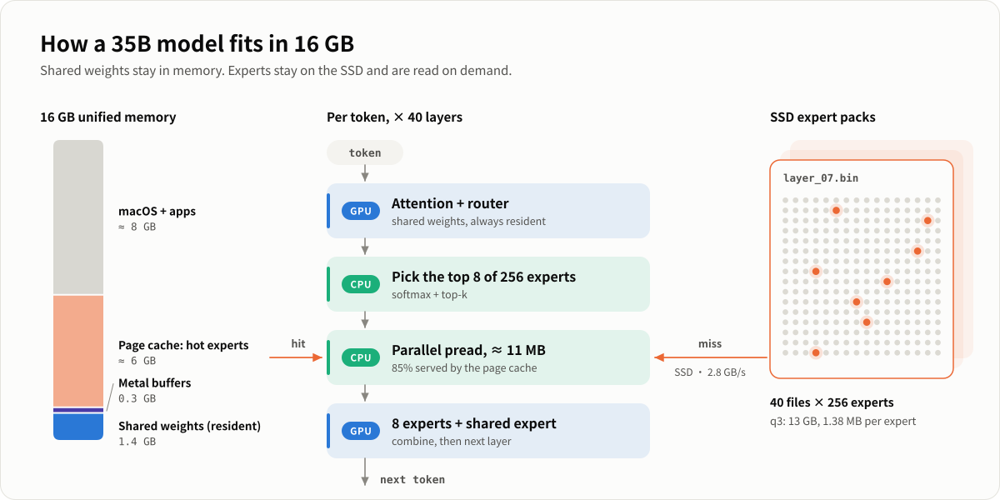
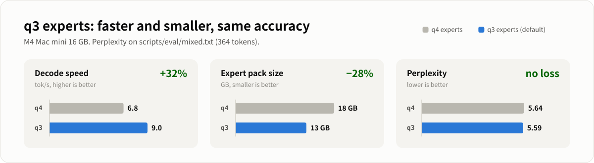
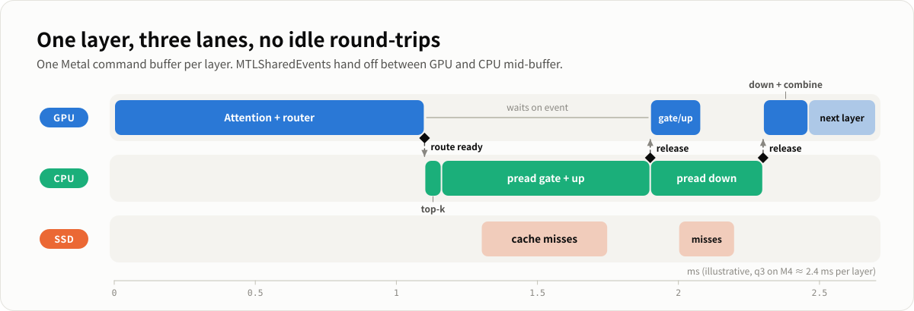

<picture>
  <source media="(prefers-color-scheme: dark)" srcset="docs/assets/hero-en-dark.svg">
  
</picture>

<p align="center">
  <a href="#quick-start">Quick start</a> ·
  <a href="#how-it-works">How it works</a> ·
  <a href="#performance">Performance</a> ·
  <a href="README.zh-CN.md">简体中文</a>
</p>

Run **Qwen3.6-35B-A3B**, a 35-billion-parameter Mixture-of-Experts model, on a
**base Mac mini with 16GB of RAM**. `nmoe` is one native Objective-C + Metal
binary: no Python, server, or ML framework at inference time.

<picture>
  <source media="(prefers-color-scheme: dark)" srcset="docs/assets/architecture-en-dark.svg">
  
</picture>

## Highlights

- **35B model on a 16GB machine.** Shared weights are about 1.4GB and stay
  resident. The routed experts (13–18GB) live on the SSD and are streamed on
  demand. Only about 3B parameters are active per token.
- **q3 expert pack, the recommended setup for 16GB.** A 3-bit requantization
  of the experts is 13GB instead of 18GB. More of it stays in the page cache,
  so decode is **32% faster** than q4 with no measurable accuracy loss.
- **Pipelined decode.** Each layer is one command buffer. The GPU signals a
  `MTLSharedEvent` when routing is ready, the CPU preads the chosen experts,
  and the GPU starts on the gate/up projections while the down weights are
  still loading.
- **Batched prompt prefill.** Prompt tokens are processed 32 at a time. Expert
  reads overlap with GPU work, and each expert is read once per chunk instead
  of once per token. The output is bit-identical to token-by-token processing.
- **Multi-turn chat.** The conversation is kept in the KV cache and the
  linear-attention state, so earlier turns are never recomputed.
- **Built-in accuracy checks.** `nmoe ppl` measures perplexity, and
  `scripts/ppl_compare.py` reports KL divergence and top-1 agreement between
  two configurations. Speedups are measured against accuracy, not judged by
  eye.

## Performance

<picture>
  <source media="(prefers-color-scheme: dark)" srcset="docs/assets/performance-en-dark.svg">
  
</picture>

Apple M4 Mac mini, 16GB, macOS 26, with a normal desktop workload running
(browser, terminal):

| Expert pack | Decode | Prompt prefill | Perplexity ¹ | KL vs q4 ¹ |
|---|---|---|---|---|
| q4 (18GB) | 6.8 tok/s | ~10 tok/s | 5.64 | — |
| **q3 (13GB), default** | **9.0 tok/s** | **15–21 tok/s** | **5.59** | 0.029 |

¹ Teacher-forced on [`scripts/eval/mixed.txt`](scripts/eval/mixed.txt), 364
tokens of mixed Chinese, English, code, and JSON. Lower perplexity is better.
KL is measured against the q4 output distribution.

Speed depends on how much of the expert pack stays in the page cache, so it
drops when other apps use a lot of memory. Decode reads about 11MB of experts
per layer, and a cache miss is served from the SSD at about 2.8GB/s. The
[optimization log](docs/optimization-log.zh-CN.md) (in Chinese) explains where
every millisecond goes.

## Requirements

- An Apple Silicon Mac. 16GB of RAM is enough; more memory makes it faster.
- macOS with Metal, and the Xcode Command Line Tools (`xcode-select --install`).
- Disk space: about 20GB for the q4 runtime package plus 13GB for the q3 pack.
  The original BF16 checkpoint (~70GB) is only needed during conversion and
  can be deleted afterwards.
- Python 3 for model preparation only: `numpy` and `huggingface_hub`, plus
  `torch` for the q3 requantizer.

## Quick start

### 1. Build

```bash
make            # produces ./nmoe
```

Metal kernels are compiled at runtime from `metal/kernels.metal`, so run
`./nmoe` from the repository root.

### 2. Get the model and convert it

```bash
python3 -m pip install -U huggingface_hub numpy torch

# Download the official BF16 checkpoint (outside this repo)
hf download Qwen/Qwen3.6-35B-A3B --local-dir ../model/Qwen3.6-35B-A3B
# (older huggingface_hub: huggingface-cli download ... --local-dir ...)

# Convert to the runtime package: shared weights, tokenizer, q4 experts
python3 scripts/convert_qwen36.py \
  --model ../model/Qwen3.6-35B-A3B --output qwen36_35b --bits 4

# Recommended on 16GB machines: derive the q3 expert pack (~15 min on an M4)
python3 scripts/requant_experts.py \
  --src qwen36_35b/packed_experts --dst qwen36_35b/packed_experts_q3 \
  --bits 3 --container q3
```

The resulting package looks like this:

```text
qwen36_35b/
  model_weights.bin, model_weights.json   # shared (non-expert) tensors, mmap'd
  tokenizer.bin, vocab.bin
  packed_experts/        layer_00..39.bin  # q4 experts (18GB)
  packed_experts_q3/     layer_00..39.bin  # q3 experts (13GB), picked by default
```

If the package lives somewhere else, symlink it with
`ln -s /path/to/qwen36_35b qwen36_35b`, or pass `--model PATH`.

### 3. Run

```bash
./nmoe ask "Explain KV cache in two sentences."
./nmoe chat                                   # multi-turn; /reset clears the conversation
./nmoe bench "Introduce quantum computing" --tokens 128 --timing --quiet
```

## Usage

| Command | What it does |
|---|---|
| `nmoe ask "PROMPT"` | One question, one streamed answer |
| `nmoe chat` | Interactive multi-turn chat; `/reset` starts over |
| `nmoe bench "PROMPT"` | Like `ask`; use with `--timing --quiet` for speed numbers |
| `nmoe ppl FILE` | Teacher-forced perplexity and top-1 accuracy over a text file |

| Option | Default | Meaning |
|---|---|---|
| `--model PATH` | `qwen36_35b` | Runtime package directory |
| `--quant auto\|2\|3\|4`, `--q2`/`--q3`/`--q4` | `auto` | Expert pack; `auto` picks q3 if present, otherwise q4 |
| `--experts N` | 8 | Routed experts per token (1–8); fewer is faster but less accurate |
| `--tokens N` | 256 (chat: 512) | Generation limit |
| `--think N` | 1 | Force `</think>` after N thinking tokens; `0` lets the model think freely |
| `--timing` | off | Print per-layer timing, decode and prefill speed |
| `--quiet` | off | Do not stream tokens |

### Choosing an expert pack

| Pack | Size | Speed on 16GB | Accuracy |
|---|---|---|---|
| q4 | 18GB | baseline | reference |
| **q3** | 13GB | +32% decode | same as q4 within noise (KL 0.029) |
| q2 | 10GB | fastest | not evaluated here; 2-bit is expected to lose quality. Experimental (`convert_qwen36.py --bits 2`) |

Reducing `--experts` is a worse trade than q3. For example, `--experts 6`
raises perplexity by about 9% (KL 0.039).

## Checking accuracy

Any change that can affect numerics (quantization, routing, kernels) should be
checked against a baseline:

```bash
NMOE_PPL_DUMP=/tmp/q4.bin ./nmoe ppl scripts/eval/mixed.txt --q4
NMOE_PPL_DUMP=/tmp/q3.bin ./nmoe ppl scripts/eval/mixed.txt --q3
python3 scripts/ppl_compare.py /tmp/q4.bin /tmp/q3.bin   # top-1 agreement, KL, ΔNLL
```

## How it works

Each token passes through 40 layers. Thirty are GatedDeltaNet linear attention
and every fourth is full attention with a KV cache. Prefill runs the same steps
for 32 tokens at a time.

<picture>
  <source media="(prefers-color-scheme: dark)" srcset="docs/assets/pipeline-en-dark.svg">
  
</picture>

- **Shared weights** (`model_weights.bin`, q4) are mmap'd once and wrapped as
  a Metal buffer.
- **Routed experts** live in one file per layer and are read with parallel
  `pread` into fixed buffers, about 1.4MB per expert at q3. The OS page cache
  is the only expert cache.
- **Expert kernels are encoded before routing is known.** Routing weights
  reach the GPU through a buffer, and `MTLSharedEvent`s gate execution, so the
  CPU never waits for a layer's command buffer to finish.

## Repository layout

```text
src/runtime.m            model, decode/prefill pipeline, ask/chat/bench/ppl
src/backend/             Metal device, pipelines, buffers
src/expert_io.m          expert pack layout and I/O
src/tokenizer.m          BPE tokenizer
metal/kernels.metal      all GPU kernels (compiled at runtime)
include/nmoe/            public C headers
scripts/convert_qwen36.py   HF safetensors -> runtime package (q4/q2)
scripts/requant_experts.py  q4 experts -> q3 experts
scripts/ppl_compare.py      compare two `nmoe ppl` dumps
scripts/*_bench.*           micro-benchmarks (matvec, pread)
docs/optimization-log.zh-CN.md   detailed optimization log (Chinese)
```

## Further reading

- [Optimization log](docs/optimization-log.zh-CN.md) (Chinese): measurements,
  experiments that worked and those that did not, and why.

## License

The code in this repository is licensed under the [Apache License 2.0](LICENSE).

Model weights are not included. They come from
[Qwen/Qwen3.6-35B-A3B](https://huggingface.co/Qwen/Qwen3.6-35B-A3B) and are
subject to their own license.
